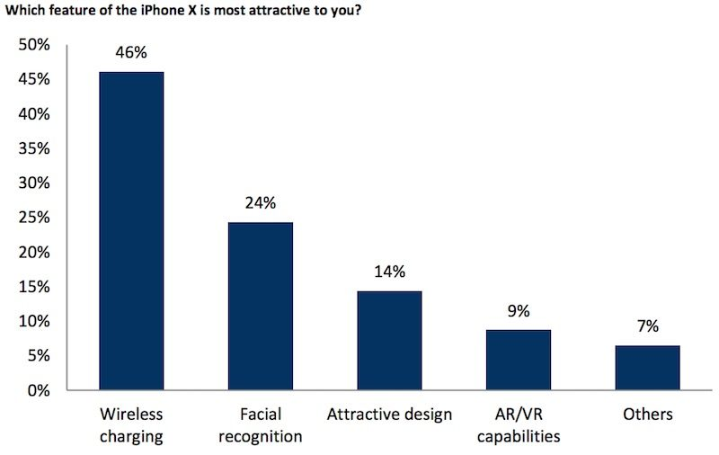
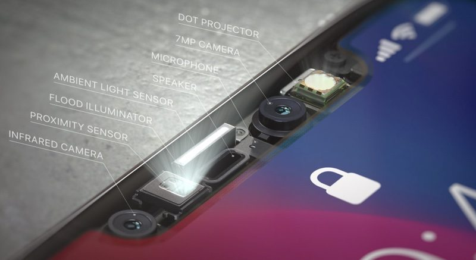
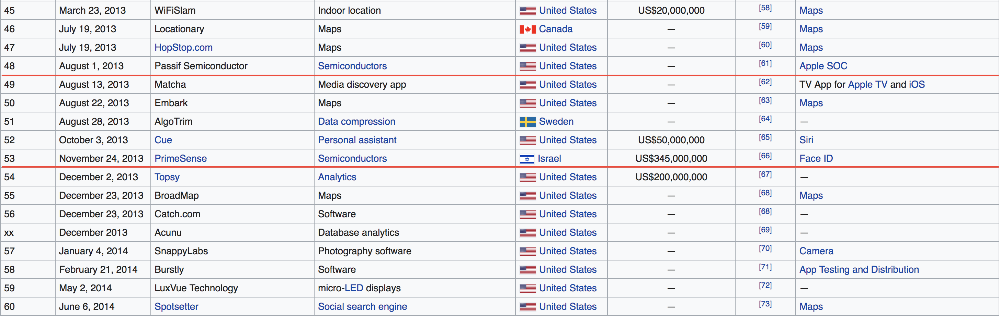
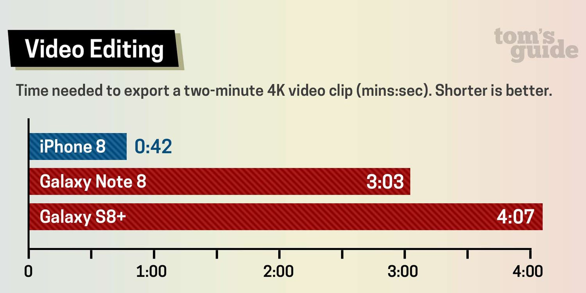
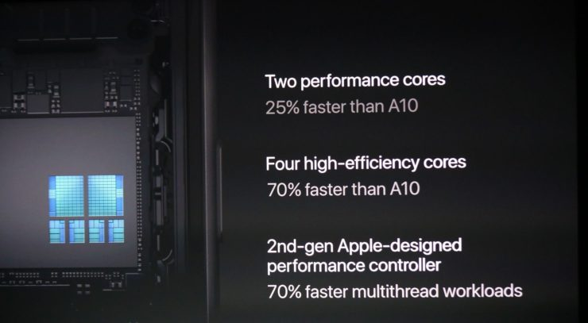
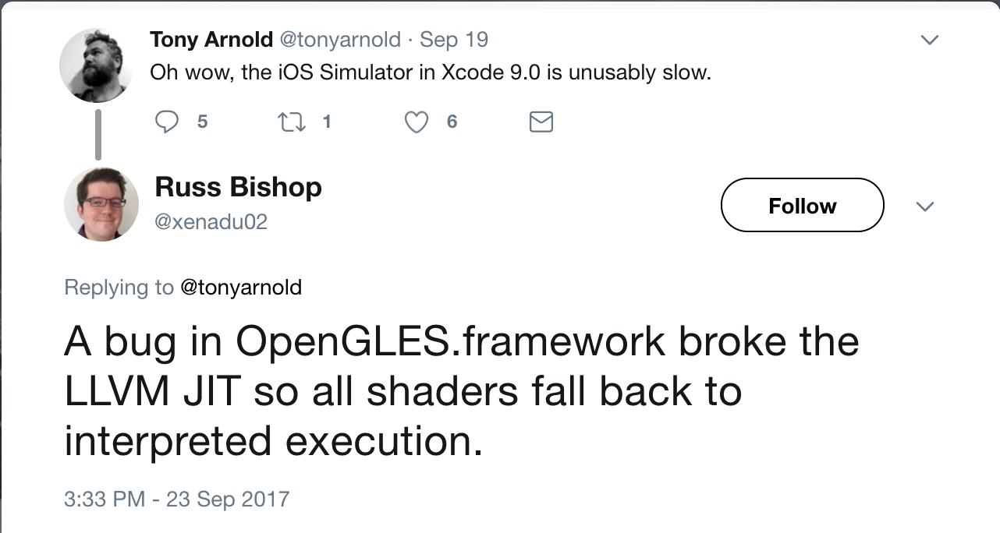

# Cocoaheads

---

# Sponsored By

---

# September 12

- iPhone X, 8, 8 Plus
- Series 3 Watch (LTE)
- 4k Apple TV
- iOS 11

---

# iPhone X
- 5.8" OLED
- A11 Bionic processor
- Glass Body
- Edge to Edge
- Facial Recognition
- No Home button

---

---

^ Essentially a miniturized Xbox Kinect Sensor

---

# iPhone 8(Plus)
## Haves

- 4.7" or 5.5" LCD
- A11 Bionic processor
- Glass Body
- Upgraded Camera
- Louder Speakers

---

# iPhone 8(Plus)
## Have nots
- Facial Recognition
- OLED
- New Design

---

# Both iPhone 8 and X
- True Tone display
- Bluetooth 5
- Wireless Charging (Qi standard)
- Support for Galileo (EU), QZSS (Japan) GPS Systems
    - Improve GPS accuracy by combining these signals

---

# Significant Number of macs running out of date firmware

EFI versions found to be out of date, leaving vunerabilities to pre-boot firmware exploits.

---

^ https://www.macrumors.com/2017/09/29/many-macs-running-out-of-date-efi-firmware/

---

# iPhone 8 Performance

---

# Outperforms i5 MacBook Pro 13

The iPhone 7 outperformed all of the MacBook Airs
The iPhone 8 outperforms all of them *and* the baseline 13" MacBook _Pro_

Geekbench Scores

- iPhone 8
    - 10170
- MacBook Pro 13
    - 9213

^ These *used* to be meaningless to compare, but no longer are
The exception to this is heat dissipation

---

# Apple Interested in Developing ARM-Based Mac Processors and iPhone Modems in House

---

---

---

# Community

---

# Apple participating in Swift Summit

Joe Groff (Runtime) and Xi Ge (Development Tools)
Includes two Developer Labs.

^ First real Apple participation in non Apple event.

---

# Design

- [UI Design for iPhone X: Bottom Elements](http://blog.maxrudberg.com/post/165590234593/ui-design-for-iphone-x-bottom-elements)
- [Supporting iPhone X](https://useyourloaf.com/blog/supporting-iphone-x)
- [Is Apple Still Detail Oriented](https://hackernoon.com/dive-into-the-details-of-ios-11-is-apple-still-detail-oriented-fe70af065a7d)
- [How iOS Apps Adapt to the iPhone X Screen Size](https://medium.com/@hacknicity/how-ios-apps-adapt-to-the-iphone-x-screen-size-a00bd109bbb9)

---

# Technical

- [Floating-point Swift, ulp, and epsilon](https://www.jessesquires.com/blog/floating-point-swift-ulp-and-epsilon)
- [Swift 4 Weak References](https://mikeash.com/pyblog/friday-qa-2017-09-22-swift-4-weak-references.html)

---

# Less Technical

- [When JSONDecoder meets the real world, things get ugly…](http://davelyon.net/2017/08/16/jsondecoder-in-the-real-world)
- [How to make Xcode take up less space](https://www.hackingwithswift.com/articles/18/how-to-make-xcode-take-up-less-space)

---

# Open Source Software

- [Find retain cycles / memory leaks sooner](https://github.com/krzysztofzablocki/LifetimeTracker)
- [Type-safe time calculations in Swift](https://github.com/dreymonde/Time)
- [Strongly Typed access to the Info.plist](https://github.com/nmdias/InfoKit)
- [AudioKit Version 4](https://github.com/AudioKit/AudioKit/tree/v4.0)

---

