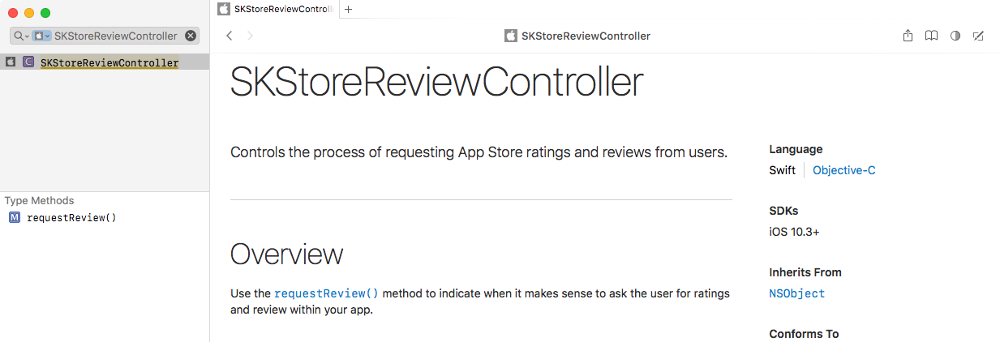

# Cocoaheads

---

# WWDC

Registration has closed

---

# Respond to App Store reviews

Users get an email if the developer responds to their review

---

>Developer links are not functioning URLs


---

> You can force touch to rate a review!


---




---


---

# Notes

- Testflight builds show rating UI but actually do nothing
- May or may not present an alert, don't present in response to a button tap or other user action.
- up to three prompts in a 365-day period
- developer.apple.com/app-store/ratings-and-reviews/

---

# Swift 3.1

Feature summary on raywenderlich.com

^ https://www.raywenderlich.com/156352/whats-new-in-swift-3-1

---

# Xcode 8.3

---

# Changes

https://developer.apple.com/reference?changes=latest_minor


---

# Features


---

# Bugs


---

# Warnings on 'Hot Code Push SDKs'

rollout.io users have begun seeing Review rejections based on:

^ "any code which passes arbitrary parameters to dynamic methods such as `dlopen()`, `dlsym()`, `respondsToSelector:`, `performSelector:`, `method_exchangeImplementations()`"

> "combined with a remote resource, can facilitate significant changes to your app’s behavior from that reviewed"

> "Even if the remote resource is not intentionally malicious, could easily be hijacked via a MiTM attack"

---

# Community

---

# Swifts Pointy Bits

A talk about Swift and Unsafe code.

https://realm.io/news/nate-cook-tryswift-tokyo-unsafe-swift-and-pointer-types

---

# Asserting equality

^ It can be easy to let `==` fall out of sync with your `struct` if you add fields
^ This will alert you if you forget

Check for outdated equality operators automatically (at runtime)

```
static func ==(lhs: Person, rhs: Person) -> Bool {
    let areEqual = lhs.name == rhs.name
    if areEqual {
        assertDumpsEqual(lhs, rhs)
    }
    return areEqual
}
```

^ https://oleb.net/blog/2017/03/dump-as-equatable-safeguard

---

# Kite

^ Powerful animation design tool


---

# Use Animation Responsibly

> don't overuse animations, or slow users down with them.

^ https://uxdesign.cc/ui-animation-please-use-responsibly-e707dbdb12d5

---

# Swift Plate

Generate cross platform Swift framework projects

 - CocoaPods
 - Carthage
 - Swift Package Manager
 - iOS
 - macOS
 - watchOS
 - tvOS
 - Linux


---

# Swift Unwrapped (Podcast)

Jesse Squires (Instagram) and JP Simard (Realm)

Discussing the language itself, its evolution and development

^ http://www.jessesquires.com/swift-unwrapped

---

# :pray: Call for speakers
