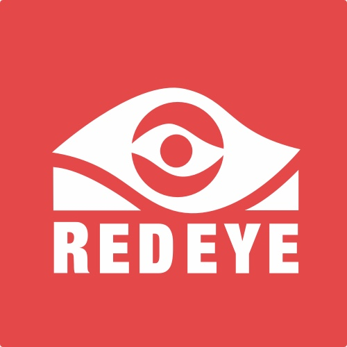
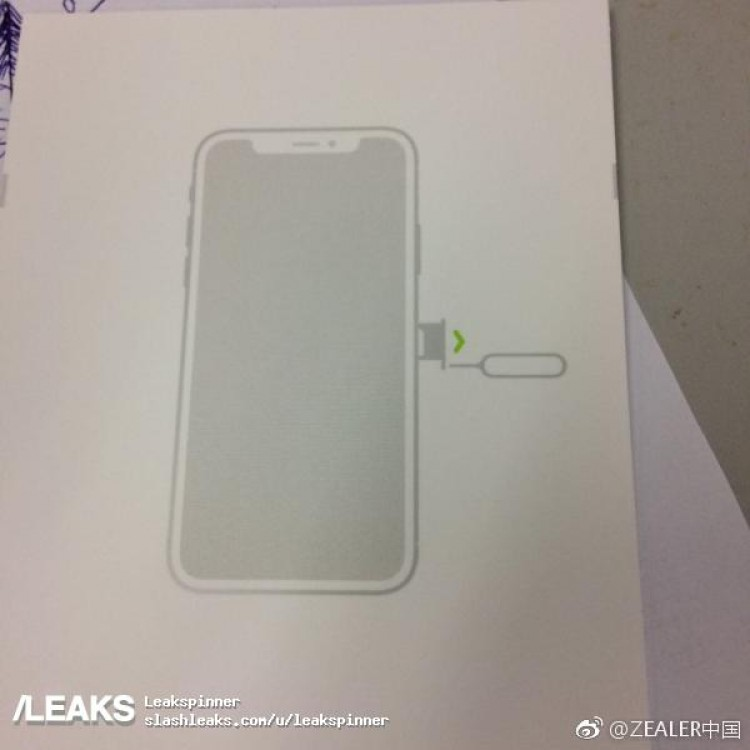
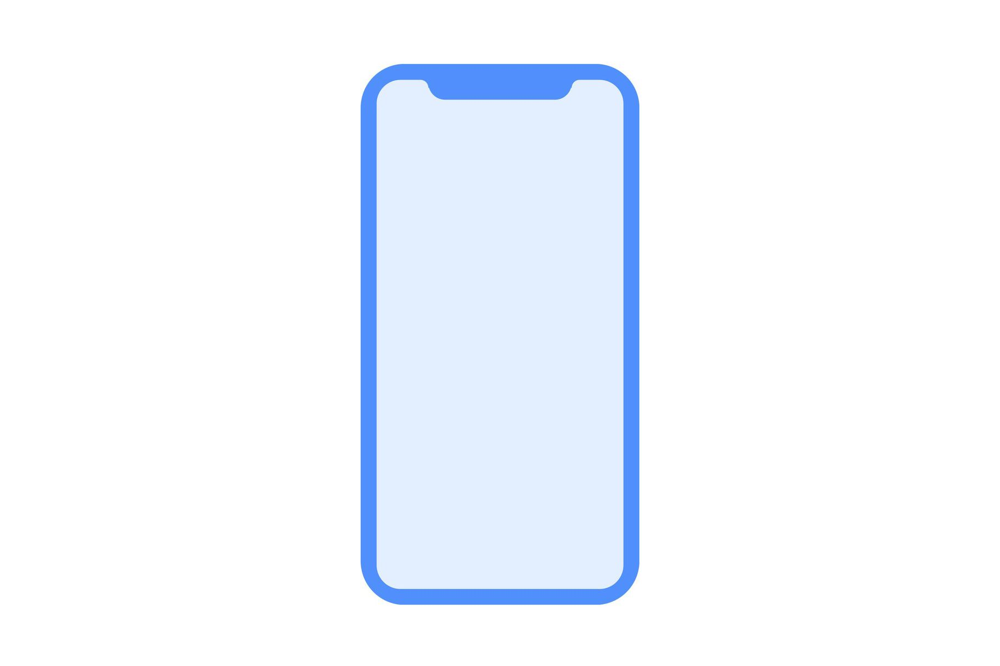
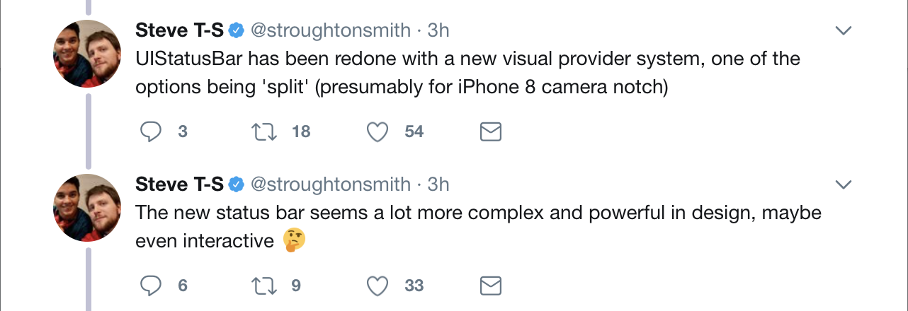
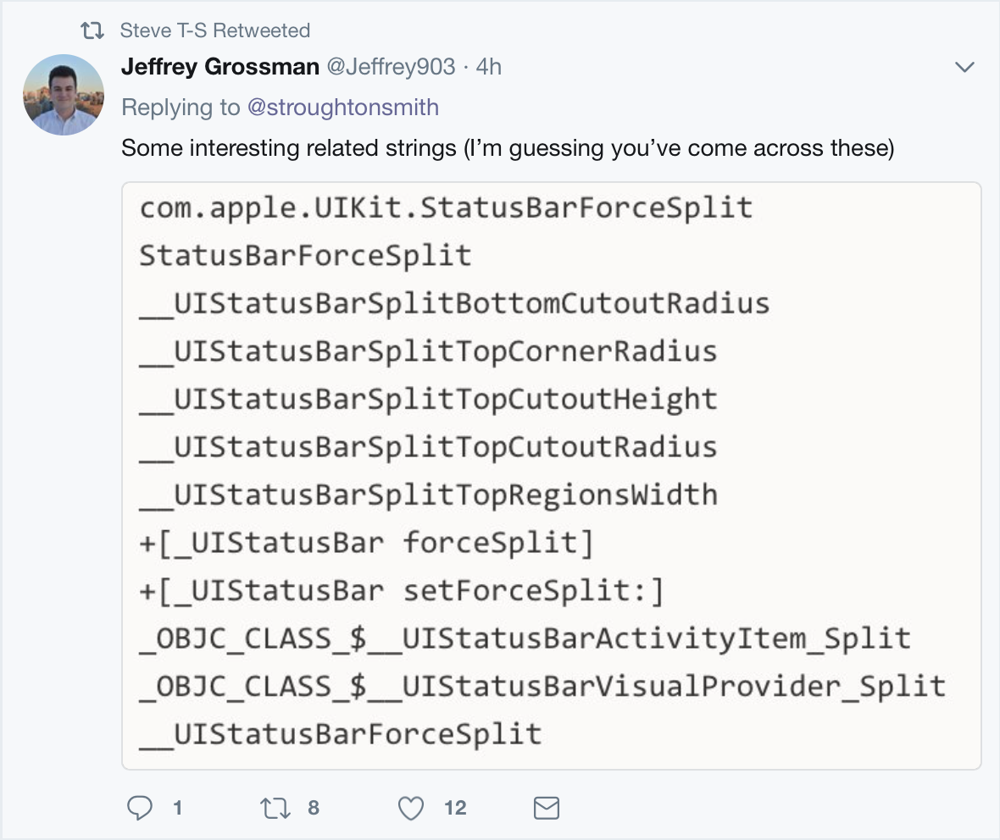
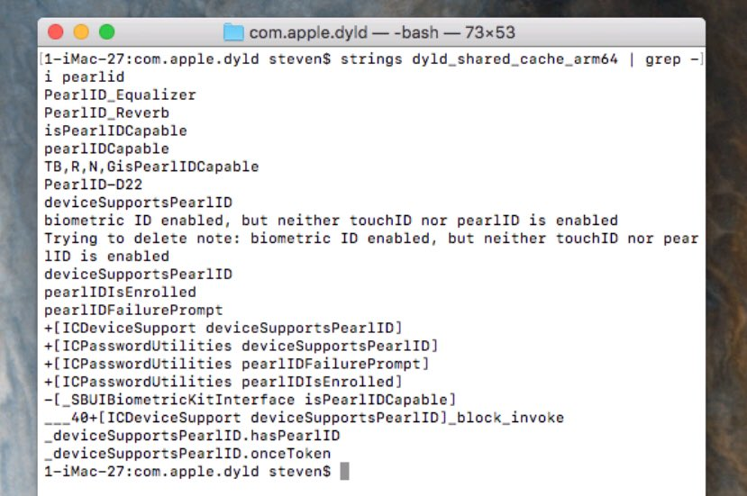
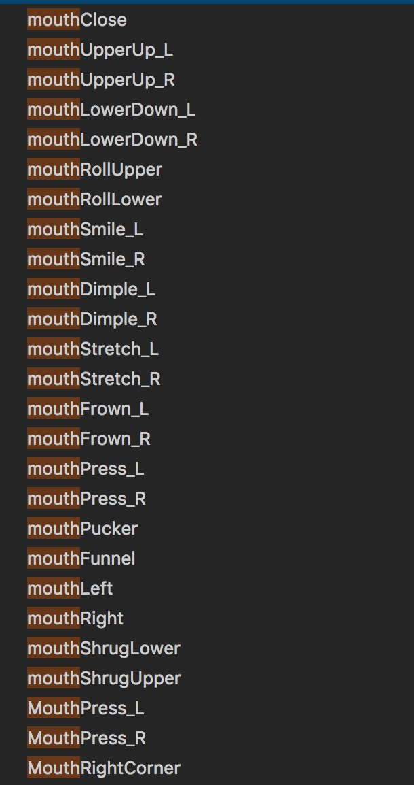
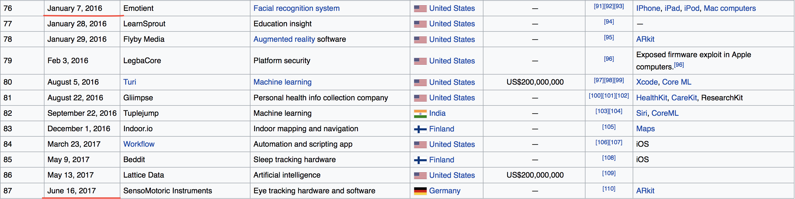
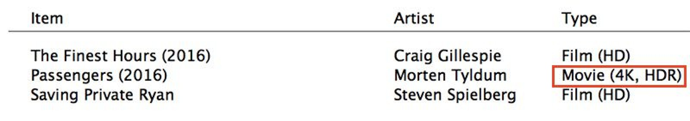

# Cocoaheads

---

# Sponsored by

---

# iPhone 8 Leaks

---

---

# HomePod Specs

- 1GB Ram
- 272 x 340 Screen

---

# HomePod Firmware Leak

---

^
No home button
Less top and bottom Bezel
Top Notch

---

---

---

# BiometricKit

- Facial Recognition using infrared camera (will work in the dark)

---

---

# New Facial Expression Detections

---

---

# Apple TV 4K?

---

# iPod Nano and Shuffles Discontinued

^ Speculation that apple will discontinue iTunes in favor of an Apple Music for macOS

---

# iOS Simulator Tips and Tricks

- Use Simulator in full-screen mode with Xcode
- Open multiple Simulators at once
- Resize like regular windows
- Others!

^
https://medium.com/flawless-app-stories/simulator-on-steroids-c12774ca6b

---

# Some Reading..

- Vision Framework for Text Detection
- Friday Q&A - Swift.Codable
- Designing Better Touch Bar Experiences
- Swift Talk 59 Refactoring with Xcode 9
- Struct References
- iOS 11 - Avoiding the blue bar of shame
- iOS 11 - Privacy and single sign on

^
http://www.appcoda.com/vision-framework-introduction
https://www.mikeash.com/pyblog/friday-qa-2017-07-14-swiftcodable.html
http://www.joecieplinski.com/blog/2017/07/18/designing-better-touch-bar-experiences
https://talk.objc.io/episodes/S01E59-refactoring-with-xcode-9
http://chris.eidhof.nl/post/references/
https://blog.set.gl/ios-11-location-permissions-and-avoiding-the-blue-bar-of-shame-1cee6cd93bbe
https://medium.com/the-traveled-ios-developers-guide/ios-11-privacy-and-single-sign-on-6291687a2ccc

---

# Apple Machine Learning Journal

> machinelearning.apple.com

