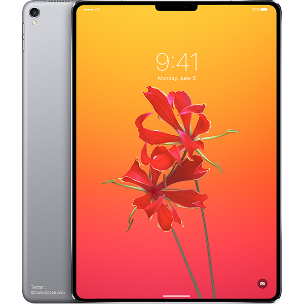
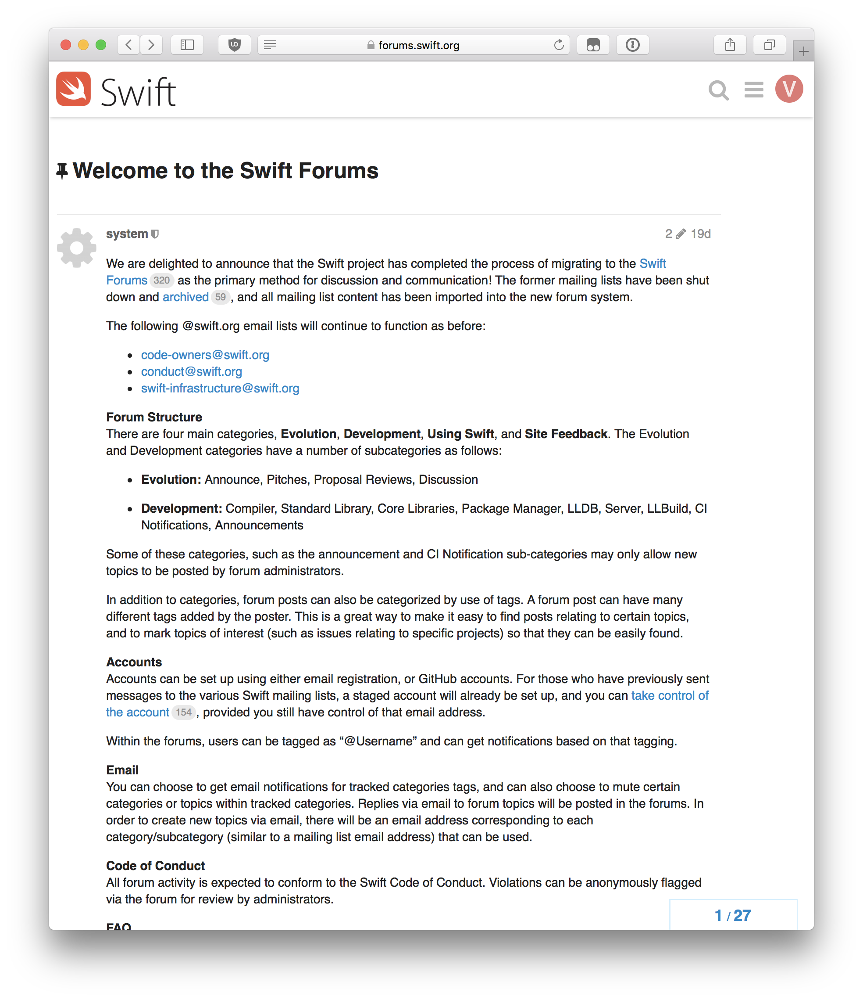

# Cocoaheads

---

# Sponsored By

---

# Apple News

---

# Performance and Quality for iOS 12

- Plans to refresh the iPhone home screen and CarPlay interface, improvements to core apps will be pushed back to 2019.
- Also plans to make iPhones more responsive

^ https://www.macrumors.com/2018/01/30/apple-to-focus-on-ios-performance-quality-issues-axios/

---

# iPhone SE 2

- Revamp to the entry level offerings

---

# iOS 11.3

- Airplay 2
- Support for storing iMessages in iCloud
- iBooks becomes Books
- Health App store for medical records
- Battery Health and Ability to disable Power Management

---

# ARKit 1.5

- Support for mapping vertical surfaces
- Better support for mapping irregularly shaped surfaces

---

# Modern iPad

- iOS 11.3 firmware points to a 'Modern_iPad' with Face ID

---

# BuddyBuild Acquisition

- the service will remain available for current customers, the company is no longer accepting new customers.
- Current free starter plans and Android app development tools will be discontinued on March 1, 2018 following the acquisition.

---

# TidBits

- Source Code for Apple's Lisa Operating System to be Released for Free in 2018

---

# Swift Forums

No more mailing lists!

---

# Swift 4.1

Will come along with Xcode 9.3

- Synthesized Equatable and Hashable
- Conditional Conformance
- `compactMap` just, `flatMap` with a better(?) name.

---

# Swift Evolution

- Compiler Diagnostic Directives (`SE-0196`)
    - `#warning("Enter API Keys")`
    - `#error("Unsupported OS")`
- Dynamic Member Lookup (`SE-0195`)
    - `Python.import("DogModule.Dog")`

---

# Apples talks @ Swift Summit
Joe Groff's talk, _Swift's Reflective Underpinnings_ and Xi Ge's talk _Creating Refactoring Transformations for Swift_ are both up on [skilled.io](skilled.io)

---

# App Architecture

Chris Eidhof, Matt Gallagher, and Florian Kugler have a new book out on Six different ways to architect an iOS app.

https://www.objc.io/blog/2018/01/19/new-book-ios-app-architecture

---

# Around the Web

- [Point Free](https://www.pointfree.co)
    - Video series exploring functional programming in Swift and more
- [Design Code](https://designcode.io)
    - An interactive book on how to design and code an iOS 11 app

---

# Open Source

- [google/xi-mac](https://github.com/google/xi-mac)
    - High performance macOS editor with a Rust backend
- [glushchenko/fsnotes](https://github.com/glushchenko/fsnotes)
    - Notes manager for macOS
- [dillidon/alerts-and-pickers](https://github.com/dillidon/alerts-and-pickers)
    - Example code showing just how much can be done using `UIAlertController`
