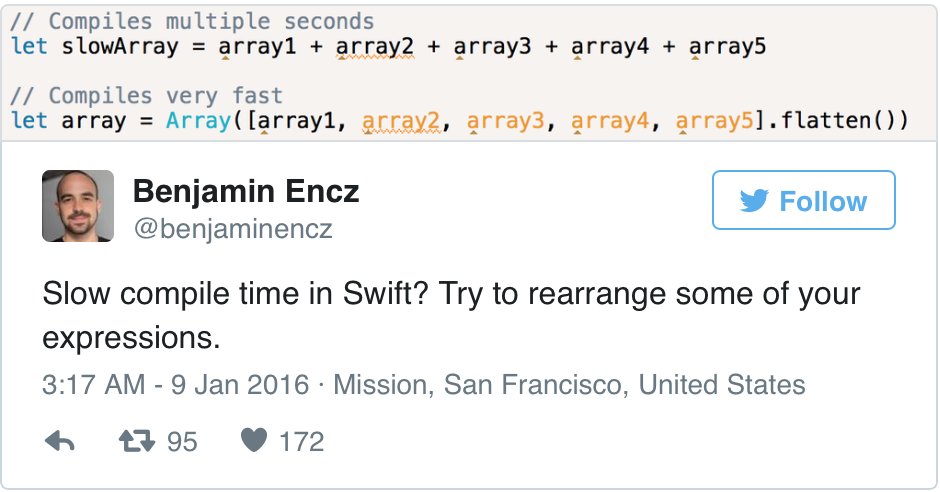

# Cocoaheads

---
# Swift is Open Source!

__*swift.org*__

Here you will find everything related to the Swift open source project.

---
## What does this mean for us?
---
## Swift is no longer platform dependent

---
## We can now see implementation details for the entirety of the stdlib.

---
# Map

```swift
extension CollectionType {
  /// Return an `Array` containing the results of mapping `transform`
  /// over `self`.
  ///
  /// - Complexity: O(N).
  @warn_unused_result
  public func map<T>(
    @noescape transform: (Generator.Element) throws -> T
  ) rethrows -> [T] {
    let count: Int = numericCast(self.count)
    if count == 0 {
      return []
    }

    var result = ContiguousArray<T>()
    result.reserveCapacity(count)

    var i = self.startIndex

    for _ in 0..<count {
      result.append(try transform(self[i]))
      i = i.successor()
    }

    _expectEnd(i, self)
    return Array(result)
  }

  ...
}
```
---
# Related Posts
How is `Bool` implemented?

Let @gregheo guide you through [^1]

[^1]:https://swiftunboxed.com/open-source/Bool/

---
# Swift Evolution[^2]

Proposals for major changes to the Swift Language reside here

[^2]:https://github.com/apple/swift-evolution

---
# Hipster Swift[^3]

Basically everything you have seen in swift that leaves you scared and confused

^
- `@noreturn`
- `@noescape`
- `dynamic`
- inline lazy vars
- method currying (_removed_)
- loop Labels

[^3]:http://krakendev.io/blog/hipster-swift

---
# Profiling Swift compilation times.[^4]



[^4]:http://irace.me/swift-profiling/

---
# iAd App Network will be Discontinued[^5]

[^5]:https://developer.apple.com/news/?id=01152016a

---
# Parse is Shutting Down[^6]

[^6]:http://bits.blogs.nytimes.com/2016/01/28/facebook-to-shut-down-parse-its-platform-for-mobile-developers/

---
# App Annie Yearly Retrospective[^7]

[^7]:http://blog.appannie.com/app-annie-2015-retrospective/
---
# Github Trending

---
# Permissions Scope[^8]

Intelligent iOS permissions UI and unified API

[^8]:https://github.com/nickoneill/PermissionScope

---
# Localize Swift[^9]

Swift 2.0 friendly localization and i18n with in-app language switching

[^9]:https://github.com/marmelroy/Localize-Swift

---
# Zip[^10]

Swift framework for zipping and unzipping files.

[^10]:https://github.com/marmelroy/Zip

---
# Material[^11]

A beautiful graphics framework for Material Design in Swift.

[^11]:https://github.com/CosmicMind/Material
