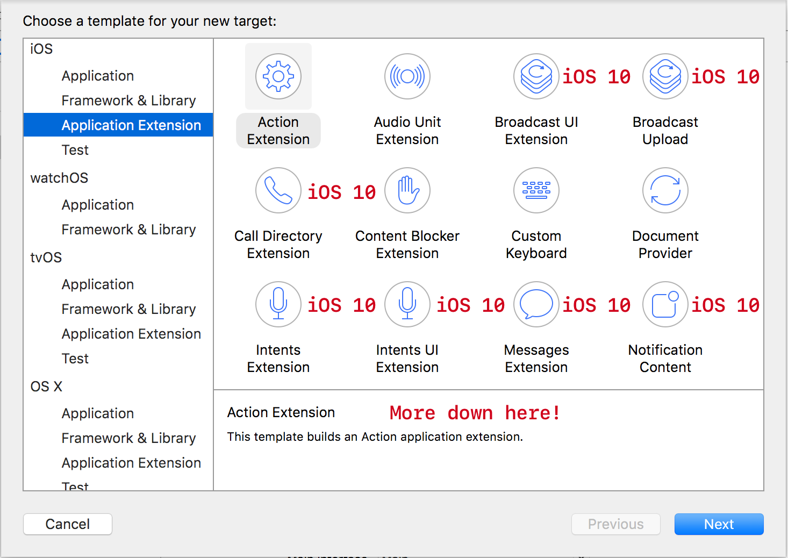
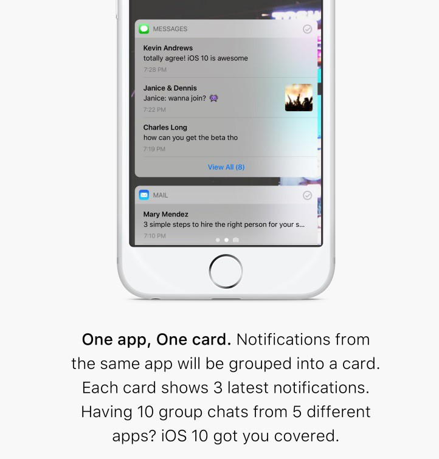
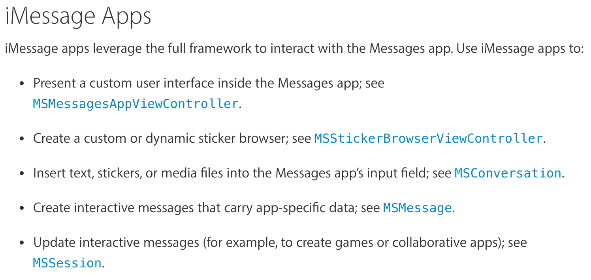
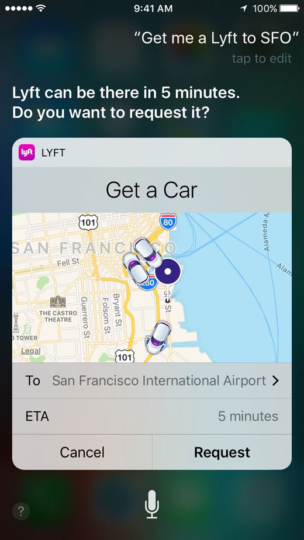
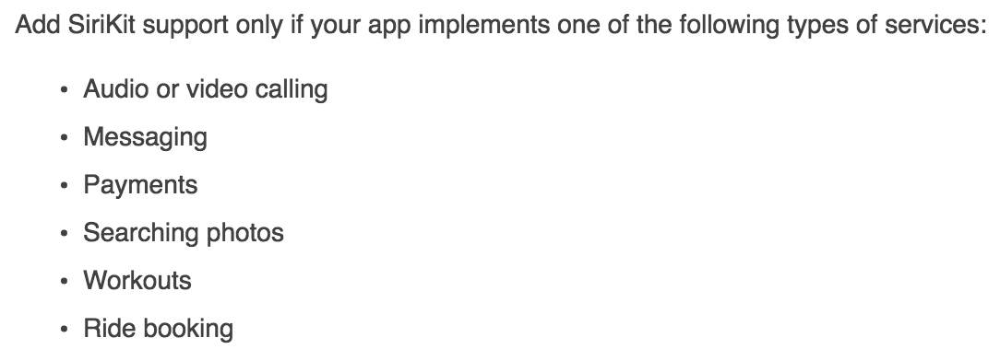
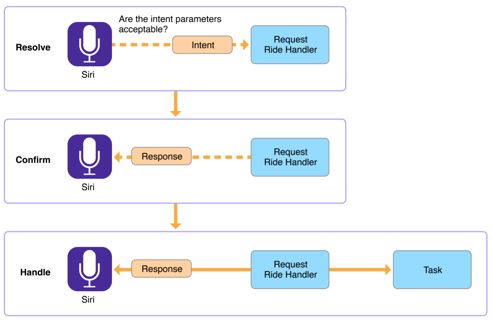

# Cocoaheads

## WWDC Edition

---
# With iOS 10 your App can do more



---
# Revised Human Interface Guidelines[^1]

With more App Extensions, widgets and new notifications come a new set of Design Guidelines

- Animation
- Interaction
- Color (True Tone displays)

[^1]: https://developer.apple.com/ios/human-interface-guidelines/

---
# Notifications

View Controllers on the lock screen
`UserNotifications.framework` & `UserNotificationsUI.framework`


```swift
@available(iOS 10.0, *)
public protocol UNNotificationContentExtension : NSObjectProtocol {

    public func didReceive(_ notification: UNNotification)

    optional public func didReceive(_ response: UNNotificationResponse,
       completionHandler completion: (UNNotificationContentExtensionResponseOption) -> Swift.Void)

    optional public var mediaPlayPauseButtonType: UNNotificationContentExtensionMediaPlayPauseButtonType { get }

    optional public var mediaPlayPauseButtonFrame: CGRect { get }

    @NSCopying optional public var mediaPlayPauseButtonTintColor: UIColor { get }

    optional public func mediaPlay()

    optional public func mediaPause()
}
```



---
# iMessage Extensions [^2]

Stickers Packs and Message Apps



[^2]: https://developer.apple.com/reference/messages

---
# Intents[^3]

```swift
public protocol INSendPaymentIntentHandling : NSObjectProtocol {

  public func handle(sendPayment intent: INSendPaymentIntent, completion: (INSendPaymentIntentResponse) -> Swift.Void)

  // ... more optional functions
}

public class INSendPaymentIntent : INIntent {

  public init(payee: INPerson?, currencyAmount: INCurrencyAmount?, note: String?, paymentMethod: INPaymentMethod?)

  @NSCopying public var payee: INPerson? { get }

  @NSCopying public var currencyAmount: INCurrencyAmount? { get }

  public var note: String? { get }

  @NSCopying public var paymentMethod: INPaymentMethod? { get }
}

class IntentHandler: INExtension, INSendPaymentIntentHandling {

  public func handle(sendPayment intent: INSendPaymentIntent, completion: (INSendPaymentIntentResponse) -> Swift.Void) { /* ... */ }
}
```


[^3]:https://developer.apple.com/reference/intents

---
# IntentsUI[^4]



View Controllers for Siri

[^4]:https://developer.apple.com/reference/intentsui

---
# SiriKit

Wait, SiriKit is _basically_ Intents.



---
# SiriKit RideSharing example[^5]



[^5]: https://developer.apple.com/library/prerelease/content/documentation/Intents/Conceptual/SiriIntegrationGuide/CreatingtheIntentsExtension.html

---
## Other Things

- Proactive Suggestions
- CallKit (`CallKit.framework`)
- Speech Recognition (`Speech.framework`)
- Shared Pasteboard (`iOS <-> macOS`)
- Plus more![^6]

[^6]: https://developer.apple.com/library/prerelease/content/releasenotes/General/WhatsNewIniOS/Articles/iOS10.html

---
# Xcode 8 Improvements

- Zoom freely on storyboards (at last)
- Runtime Debugging
- Layout Debugging
- Visual Debugging
- Thread Sanitizer
- Automatic Code-Signing
