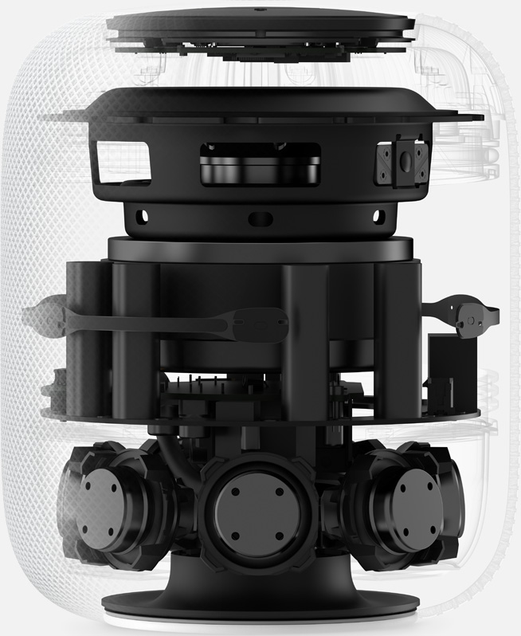

# Cocoaheads 
## June 06

---

# WWDC '17

---

# New API's (SDK's)

---

- ARKit
- Vision
- IdentityLookup
- CoreML
- DeviceCheck
- FileProvider(UI)
- CoreNFC

---

# Device Check

---

# But first
## Breif recap

---

> Device fingerprints are a common technique used across the industry for a variety of security purposes, including fraud detection
-- Uber

---

> In Uber’s case, fingerprinting kept drivers, especially those in China, from gaming a promotion that rewarded them for maximizing ride volume.
-- Wired

---

> Don't do that
-- Apple

---

# Device Check

> Access per-device, per-developer data that your associated server can use in its business logic.
> You might use this data to identify devices that have already taken advantage of a promotional offer that you provide
-- Apple

---

# Vision

Apply high-performance image analysis and computer vision techniques to identify faces, detect features, and classify scenes in images and video.

---

- Face Detection and Recognition
- Barcode Detection
- Image Alignment Analysis
- Text Detection
- Horizon Detection
- Object Detection and Tracking

---

Couple of interesting things here:
- Apple didn't follow Swift naming convention for these _psuedo_ enum cases
- There is a barcode kind called aztec

```swift
struct VNBarcodeSymbology: RawRepresentable, Equatable, Hashable {
    static let aztec: VNBarcodeSymbology
    static let CODE39: VNBarcodeSymbology
    static let code39Checksum: VNBarcodeSymbology
    static let code39FullASCII: VNBarcodeSymbology
    static let code39FullASCIIChecksum: VNBarcodeSymbology
    static let CODE93: VNBarcodeSymbology
    static let code93i: VNBarcodeSymbology
    static let CODE128: VNBarcodeSymbology
    static let dataMatrix: VNBarcodeSymbology
    static let EAN8: VNBarcodeSymbology
    static let EAN13: VNBarcodeSymbology
    static let I2OF5: VNBarcodeSymbology
    static let i2OF5Checksum: VNBarcodeSymbology
    static let ITF14: VNBarcodeSymbology
    static let PDF417: VNBarcodeSymbology
    static let QR: VNBarcodeSymbology
    static let UPCE: VNBarcodeSymbology
}
```

---

# CoreML


Support for existing trained models from major ML frameworks

---

# IdentityLookup


> Create an app extension that can identify and filter unwanted SMS and MMS messages while preserving user privacy.
-- Apple

---

# FileProvider & FileProviderUI

> Implement a file provider extension to let other apps access the documents and directories that are stored and managed by your containing app.
-- Apple

<br>

> Add actions to the document browser's context menu.
-- Apple

---

# CoreNFC

> Detect NFC tags and read messages that contain NDEF data.
-- Apple

^Note, I cannot currently `import CoreNFC`

---

# ARKit
## Demo


---

# Xcode updates

---

# Source Control in the Navigator

^Good bye cmd + 4 for errors


---

# Hello refactoring

<br>


---


---

- Markdown support
- Issues with more detail and less code rearrangement
- Faster
- Swift Playgrounds style tokenized editing  


---

# Swift

---

# Source Editor rewritten in Swift

---

> Xcode 9 lays the groundwork for first-class, native support in Xcode for Swift packages with the preview version of its new build system. This build system provides the flexibility and extensibility needed to allow Xcode to support new build models, such as Swift packages. Additionally, considerable work has gone into the SwiftPM library vended by the SwiftPM project, which will support integrating Swift packages into tools like Xcode.
-- SwiftPM mailing list

---

# iOS Updates
## Demo

---

# iPad

- Drag n Drop
- New iPad Pro
- Swift Playgrounds 2
	- Support ARKit
	- Support connections to external devices (drones, lego..)

---

# macOS High Sierra

- VR support
- Metal 2
- APFS
- HEVC (video compression)
- Safari Tracking Prevention
- Last macOS to support 32 bit applications

---

> Remember when you looked at that green mountain bike online? And then saw annoying green mountain bike ads everywhere you browsed? Safari now uses machine learning to identify advertisers and others who track your online behaviour, and removes the cross-site tracking data they leave behind. So your browsing stays your business.
^ Poor Google Analytics

---

# New iMac Pro

Up to 18 core CPU's from intel, up to 128 GB of DDR4 ECC Ram

---

# CPU Bumps for Macbook Pro

- Macbook Pro lineup using Intel's Kaby Lake CPU's
- Still no 32GB model

---

# HomePod



