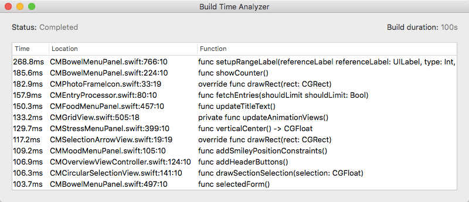

# Cocoaheads News

---

# Undo History in Swift[^1]

- Use of `struct` semantics to create an incredibly simple undo manager

[^1]: http://chris.eidhof.nl/post/undo-history-in-swift/

---

# One way to think of structs[^2]

It can be easier to think of a `class` as a `struct`

```swift
struct Class {
  let pointer: UnsafePointer<HeapObject>
}
```

[^2]: Credit goes to [bradhilton](https://zewo.slack.com/team/bradhilton) from the Zewo team on slack

---

# Enumerations in Depth[^3]

Everything about my personal favorite Swift datatype

[^3]: http://andybargh.com/swift-enumerations/

---

# Using Strings as BigInts[^4]

An interesting approach to creating a `BigInt` type using `String` for storage.

[^4]: https://beaunouvelle.com/large-numbers-with-swift-big-int/

---

# Swift Graph Views[^5]


[^5]: https://github.com/philackm/Scrollable-GraphView

---

# Random number generators in Swift[^6]

> Yes, it’s true: with a little tuning, C can be just as fast as Swift.

[^6]: http://www.cocoawithlove.com/blog/2016/05/19/random-numbers.html

---

# An easy way to convert Swift structs to JSON[^7]

Basically a reminder that the reflection API exists.

If interested checkout the [Mirror](http://swiftdoc.org/v2.2/type/Mirror/) documentation


[^7]: http://codelle.com/blog/2016/5/an-easy-way-to-convert-swift-structs-to-json/

---

# Build Time Analyzer for Xcode[^8]



[^8]: https://github.com/RobertGummesson/BuildTimeAnalyzer-for-Xcode

---

# Polymorphism and Protocol Extensions[^9]

```swift
extension Populable {
  func render(data: Image) {
    print("Render Image \(data.image)")
  }
}

extension Populable {
  func render(data: Movie) {
    print("Render Movie \(data.url)")
  }
}

extension Populable {
  func render(data: TextMessage) {
    print("Render TextMessage \(data.message)")
  }
}
```

[^9]: http://ctarda.com/2016/04/polymorphism-and-protocol-extensions/

---

# ABI Compatibility[^10]

> ABI compatibility, for our purposes, refers to the ability to link pre-built (binary) libraries with arbitrary versions of a compiler.

[^10]: http://www.bensnider.com/abi-compatibility-whoopdty-do-what-does-it-all-mean.html

---

# Swift Changelog

A **much** quicker way to see the changes to the language

https://github.com/apple/swift/blob/master/CHANGELOG.md

---

# WWDC Rumours

- iOS 10
- New OSX (MacOS)
- New watchOS & tvOS
- Siri SDK (possibly accompanying device)
- Siri on Mac
- Homekit Changes
- Device deprecation

---

End

