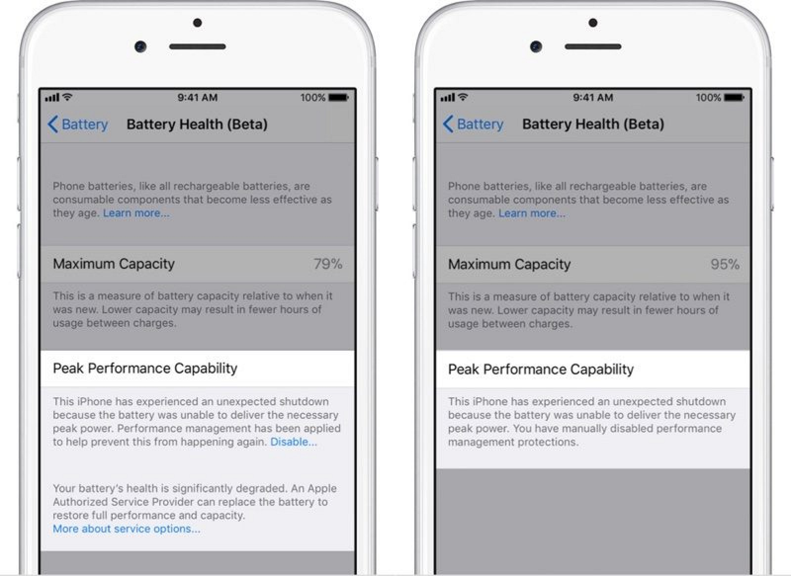
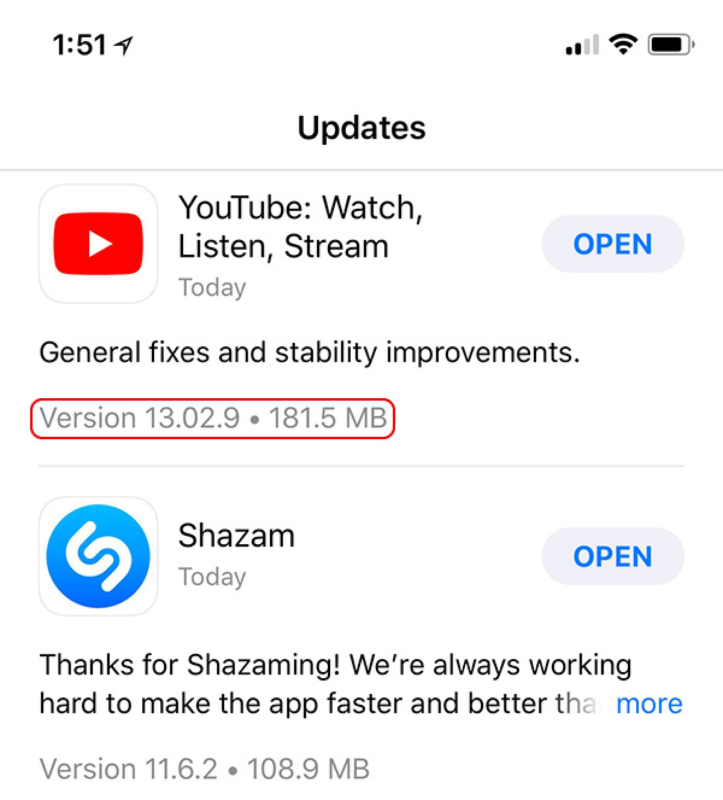
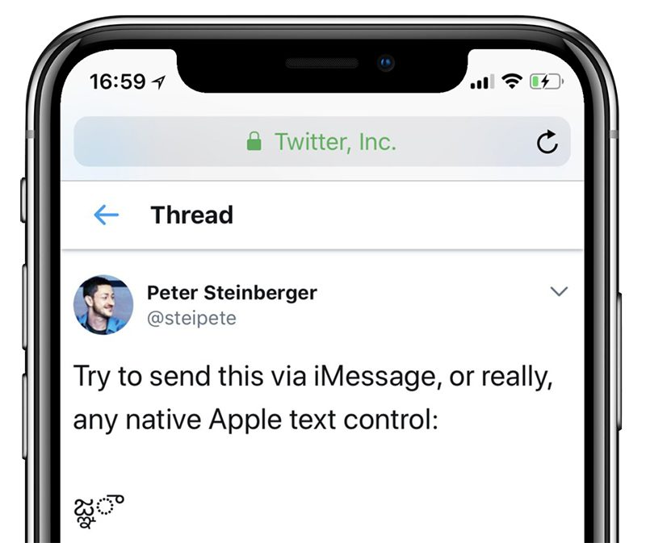
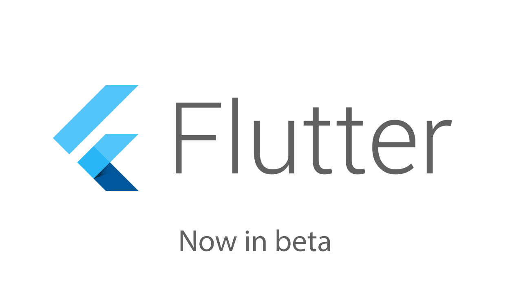
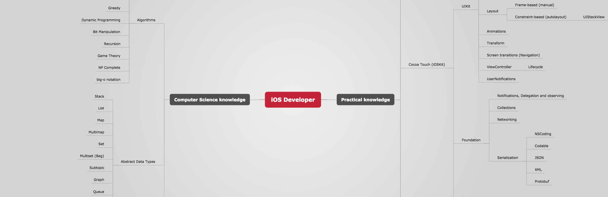

# Cocoaheads

---

# Sponsored By


---

# Apple News

---

Battery health in iOS 11.3 Beta 2



---

App store shows App size for updates



---

## Apple to launch cheaper MacBook Air in 2Q 2018

Last revision *273* days ago, just bumped CPU
Last major revision was *819* days ago

Source: KGI Securities analyst Ming-Chi Kuo

---

## Fix for Telugu Character Bug



---

## iOS 11 Jailbreak

Electra released for iOS 11 through iOS 11.1.2

---

## Flutter enters Beta



^ https://developers.googleblog.com/2018/02/announcing-flutter-beta-1.html

---

# Open Source Swift

---

# apple/swift-nio

Event-driven network application framework for high performance protocol servers & clients, non-blocking.

> `EventLoopGroup`, a protocol
> `EventLoop`, a protocol
> `Channel`, a protocol
> `ChannelHandler`, a protocol
> `Bootstrap`, several related structures
> `ByteBuffer`, a struct
> `EventLoopPromise` and `EventLoopFuture`, two generic classes.

---


---

# BohdanOrlov/iOS-Developer-Roadmap

Roadmap to becoming an iOS developer in 2018.

^ Lists topics important to iOS development
^ ViewController Lifecycle
^ Architectures
^ Layout
^ Multithreading



---

# nicklockwood/Consumer

Recursive descent parser generator

```swift
let integer: Consumer<String> = .any([
    .string("0"),
    .sequence([
        .charInRange("1", "9"),
        .zeroOrMore(.charInRange("0", "9")),
    ]),
])
```

---

# frogg/Steal-Phone-Number

An exploit that allows every app to steal a user's phone number without asking for any permissions.

Dependent upon the provider website auto sign in behavior

---

# tattn/MoreCodable


Makes Swift's `Codable` better

```swift
enum CodingKeys: String, RuleBasedCodingKey {
    case userId
    case name

    func codingKeyRule(key: String) -> String {
        return key.uppercased() // custom rule
    }
}
```
