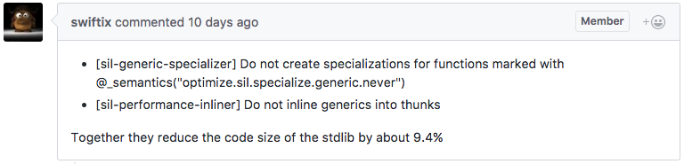
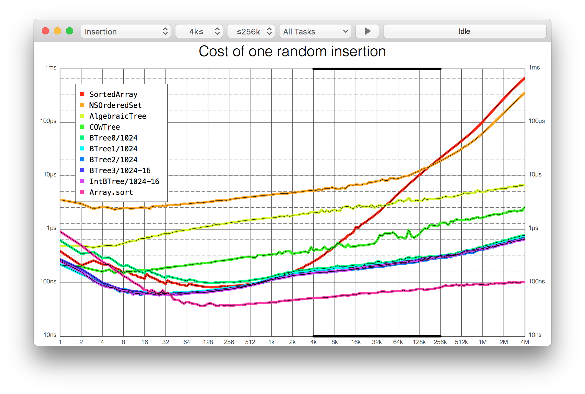

# Cocoaheads

--- 

## Playgroundscon

Great talks which will be available some time in the future on skilled.io

playgroundscon.com

---

## MacOS 10.12.4

- Night Shift

---

## Xcode 8.3

Less bugs.

---

## Swift 3.1

```
extension Array where Element == Int { }
```
```
struct OuterNonGeneric {
 struct InnerGeneric<T> {}
}
struct OuterGeneric<T> {
 struct InnerNonGeneric {}
 struct InnerGeneric<T> {}
}
extension OuterNonGeneric.InnerGeneric {} 
```

---

## Swift 4.0 Release Process

This will be quite similar to Swift 3.0.

The largest difference between 2 -> 3 and 3 -> 4 will be source compatibility.

---

# :tada:

---

## Articles of Interest

---

## Migrating Firefox for iOS to Swift 3.0

Includes a useful list of what caused compiler segfaults during.

Also worth noting is that the Firefox app is all open source.

https://github.com/mozilla-mobile/firefox-ios
https://mozilla-mobile.github.io/ios/firefox/swift/core/2017/02/22/migrating-to-swift-3.0.html

---

## Swift Changes Considered Harmful

Mentions Sample code from October 2016 for Xcode 8 that doesn't compile and the difficulty for a beginner to pick up with so misleading and unhelpful samples around.

http://furbo.org/2017/02/17/swift-changes-considered-harmful/

---

## Reduced Stdlib size



---

## Bridging From Swift to ObjC

If you are writing both alongside one another. This may help.

http://blog.benjamin-encz.de/post/bridging-swift-types-to-objective-c/

---

## Swift Ownership Manifesto

Rust style borrow checker, non ARC code made simple? Really this document describes a dedication from Apple to pushing Swift onto as many problem domains as possible.

https://github.com/apple/swift/blob/master/docs/OwnershipManifesto.md

---

## Effective use of shadows and blurring 

A discussion on how, when and why to use these effects in your UI's

https://www.smashingmagazine.com/2017/02/shadows-blur-effects-user-interface-design/

---

## Cool Libs

---

## Guitar Cross Platform String Library

Includes:
- Casing manipulation
- `reverse`, `length`, `first`, `last`
- trimming
- truncating...
- `left-pad` (and others)

https://github.com/ArtSabintsev/Guitar

---

## PanelKit


https://github.com/louisdh/panelkit

---

## SwipeCellKit


https://jerkoch.com/2017/02/07/swiper-no-swiping.html
https://github.com/jerkoch/SwipeCellKit

---

## Twitter Image Pipeline

https://blog.twitter.com/2017/introducing-twitter-image-pipeline-ios-framework-for-open-source
https://github.com/twitter/ios-twitter-image-pipeline

---

## Benchmarking made better



https://github.com/lorentey/Attabench
