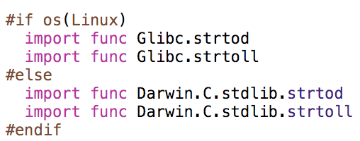
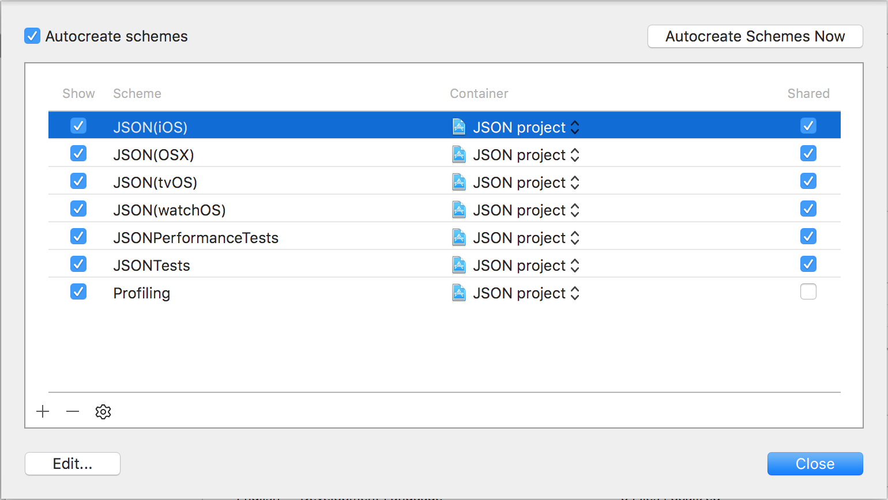

# JSON as a learning experience

```swift
/// Any value that can be expressed in JSON has a representation in `JSON`.
enum JSON {
  case object([String: JSON])
  case array([JSON])
  case null
  case bool(Bool)
  case string(String)
  case integer(Int64)
  case double(Double)
}
```

---

## Tagging releases

[Semantic Versioning](http://semver.org/) is vital to all dependency managers.

<br>


---

## Writing cross platform Swift

You have to be careful when using `Foundation`

```swift
#if os(Linux)
  // Linux
#else
  // Darwin (likely?)
#endif
```

---

## Scoped import statements

Something of interest:



---

## Level 1
### Carthage

Easy mode.

---

It's as simple as sharing your schemes!



---

## Level 2
### CocoaPods

Slightly Harder.

---

 Requires a `.podspec` & a more involved versioning process.

```ruby
Pod::Spec.new do |s|
  s.name         = "NativeJSON"
  s.version      = "0.2.2"
  s.summary      = "Native JSON is a full featured cross platform JSON library written entirely in Swift"
  s.homepage     = "https://github.com/vdka/JSON"
  s.license      = { :type => "MIT" }
  s.author       = { "Ethan Jackwitz" => "ethanjackwitz@gmail.com" }

  s.requires_arc = true
  s.osx.deployment_target = "10.9"
  s.ios.deployment_target = "8.0"
  s.watchos.deployment_target = "2.0"
  s.tvos.deployment_target = "9.0"
  s.source       = { :git => "https://github.com/vdka/JSON.git", :tag => s.version.to_s }
  s.source_files = 'Sources/*'
end
```

---

## Level 3
### Swift Package Manager

Here be dragons.

---

Requires a `Package.swift` file and a specific directory layout.

Running `swift build --init` creates the layout you need.

<br>


---

## Package.swift

```swift
import PackageDescription

let package = Package(
  name: "JSON",
  targets: [
    Target(name: "JSON"),
    Target(name: "JSONTests",
      dependencies: [.Target(name: "JSON")]),
  ] // optional but allows testing.
)
```

---

## SPM Shortcomings

- Pre Release
- Xcode integration [^1]
- Development occurs on the `master` branch of `apple/swift`

[^1]: http://cjwirth.com/2016/03/07/using-xcode-and-spm-together/

---

## Do **NOT** Forget

```swift
public
```

---

## Some Swift syntax

Some examples of Swift syntax that improve clarity and brevity.

---

### Nested types for Errors

Here `JSON.Parser` will only ever throw a `JSON.Parser.Error`

```swift
extension JSON.Parser {
  enum Error: String, ErrorType {
    case missingColon
    case trailingComma
    case expectedColon
    case invalidSyntax
    case invalidNumber
    case invalidLiteral
    case invalidUnicode
    case endOfStream
  }
}
```

---

### Nested types for Discoverability

Where it makes sense Swift types can be nested within one another which _can_ provide easy discoverability into your frameworks.

`JSON` has One root level object and numerous extensions upon it.

---

### Documentation comments

Comments that begin with `///` will show up in Xcode completion menu as a sort of _brief_


This is one of the most useful forms of documentation for your API consumers.

Other more powerful forms of SwiftDocs [^1]

[^1]: http://ericasadun.com/2015/06/14/swift-header-documentation-in-xcode-7/

---

### Option sets

```swift
    struct Option: OptionSetType {
      public init(rawValue: UInt8) { self.rawValue = rawValue }
      public let rawValue: UInt8

      /// Serialize `JSON.null` instead of skipping it
      public static let noSkipNull = Option(rawValue: 1 << 1)
      /// Serialize with formatting for user readability
      public static let prettyPrint = Option(rawValue: 1 << 2)
      /// When specified with `.prettyPrint` will use windows style newlines for formatting. Boo.
      public static let windowsLineEndings = Option(rawValue: 1 << 3)
    }
```

---

Turns

```swift
func serialized(prettyPrint prettyPrint: Bool = false, skipNull: Bool = true, windowsLineEndings: Bool = false) -> String {
  //...
}
```

into

```swift
func serialized(options options: [Option] = []) -> String {
  //...
}
```

---

## Swift limitations
### and ways around them

```swift
extension Optional where Wrapped == JSON {
  // Same-type requirement makes generic parameter 'Wrapped' non-generic
}
```

This sucks but is intended to be a future feature of the Swift compiler

---

### The work around

```swift
/// WARNING: Internal type. Used to constrain an extension on Optional to be sudo non Generic.
public protocol _JSON {}
extension JSON: _JSON {}

extension Optional where Wrapped: _JSON {

  /// Returns a `String` iff `Wrapped == JSON.string(_)`
  public var string: String? {
    guard let `self` = self as? JSON else { return nil }
    return self.string
  }

  //...
}
```

---

## Extensions

Extensions to native Swift types make your swift framework better.

```swift
extension RawRepresentable where RawValue: JSONDecodable {
  public static func decode(json: JSON) throws -> Self {
    guard let value = json.value as? RawValue else { throw JSON.Error.BadValue(json.value) }
    return try Self(rawValue: value) ?? JSON.Error.BadValue(value)
  }
}


extension Array where Element: JSONDecodable {
  public static func decode(json: JSON) throws -> [Element] {
    guard let array = json.array else { throw JSON.Error.BadValue(json.value) }
    return try array.map(Element.decode)
  }

  public init(json: JSON) throws {
    guard let array = json.array else { throw JSON.Error.BadValue(json.value) }
    self = try array.map(Element.decode)
  }
}
```
