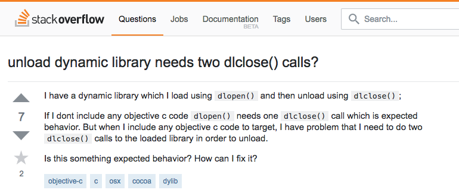
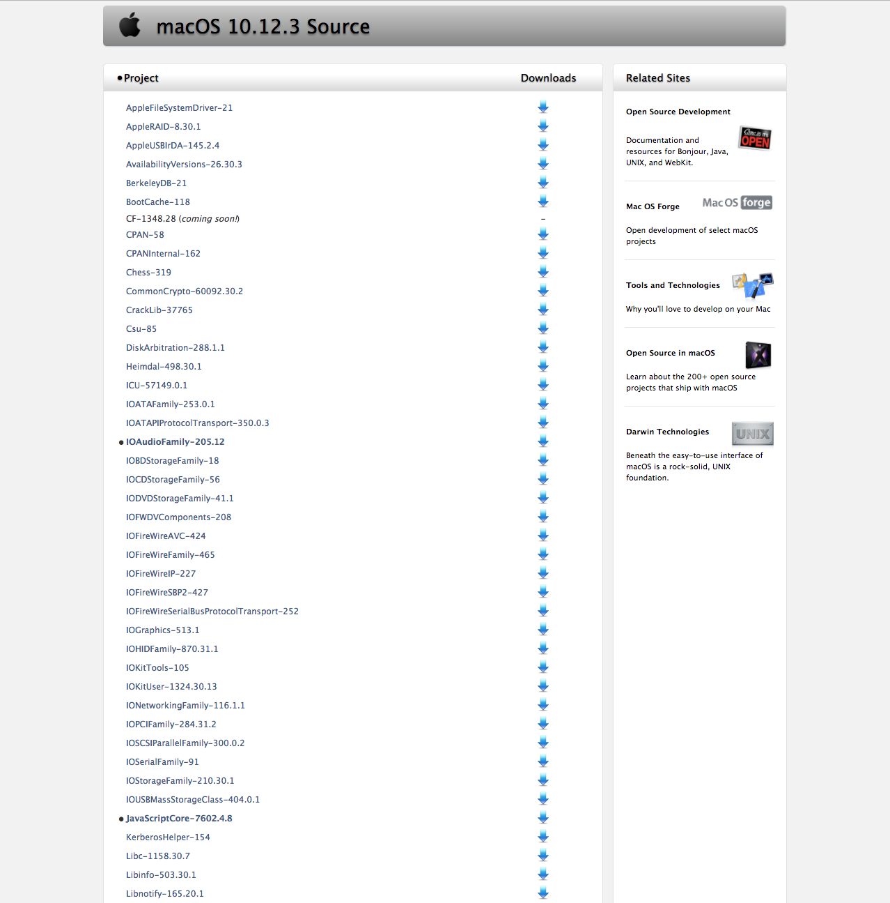
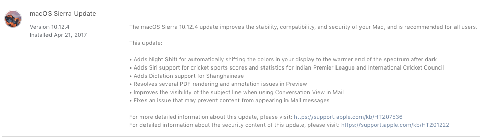
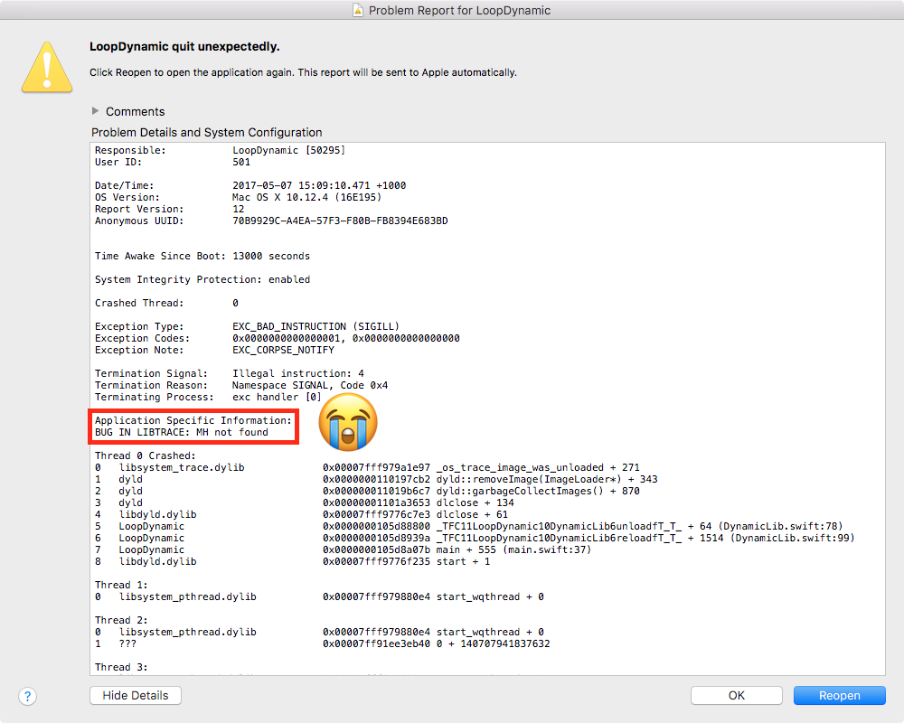
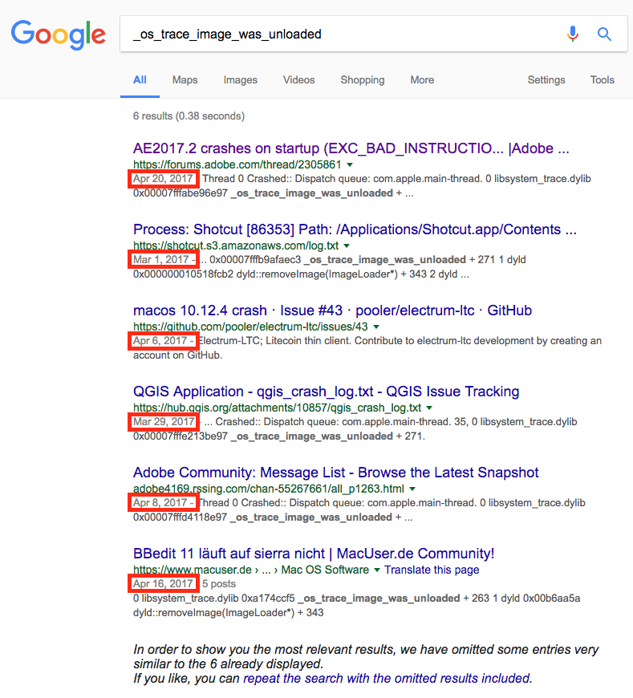

# The setup

```swift
class Lib {
    let path: String
    var handle: UnsafeMutableRawPointer?
    var lastReadTime: Int?
}
```

---

```swift

extension Lib {
    var lastWriteTime: Int? {
        var fileStats = stat()
        guard stat(path, &fileStats) == 0 else { return nil }
        return fileStats.st_mtimespec.tv_sec
    }

    func load() {
        handle = dlopen(path, RTLD_LAZY)
        assert(handle != nil, dlError)
        lastReadTime = lastWriteTime
    }

    func unload() {
        guard dlclose(handle) == 0 else { fatalError(dlError) }
        self.handle = nil
    }
}
```

---

```swift
extension Lib {
    var shouldReload: Bool {
        return lastWriteTime != lastReadTime
    }

    func reload() {
        guard shouldReload else { return }
        unload()
        usleep(10)
        load()
        print("\(path.basename) reloaded successfully at \(getTime())")
    }
}
```

---

# Loading Symbols

```swift
extension Lib {
    func symbol(named name: String) -> UnsafeMutableRawPointer? {
        guard handle != nil else { return nil }
        let symbol = dlsym(handle, name)
        return symbol
    }

    func symbol<T>(named name: String, withType: T.Type) -> T? {
        guard let symbol = symbol(named: name) else { return nil }
        return unsafeBitCast(symbol, to: T.self)
    }
}
```

---

# The Loop

```swift
let lib = DynamicLib(path: "@executable_path/Asteroids")
lib.load()

typealias LoadFunction   = @convention(c) () -> UnsafeMutableRawPointer?
typealias UpdateFunction = @convention(c) (UnsafeMutableRawPointer) -> Void

let setup = lib.symbol(named: "setup", withType: LoadFunction.self)
var memory = setup!()

// The start of the persisted memory must be an Int representing the size 
//   of the currently persisted memory. If the size is 0 then it's the lib indicating it is done.
while memory.assumingMemoryBound(to: Int.self).pointee != 0 {
    if lib.shouldReload {
        lib.reload()
    }
    let loop = lib.symbol(named: "update", withType: UpdateFunction.self)
    loop?(memory)
}
```

---

# The Altering

```swift
// ...
    if lib.shouldReaload {
        let pre = lib.symbol(named: "preReload", withType: PreFunction.self)
        pre?(memory)

        lib.reload()

        let post = lib.symbol(named: "postReload", withType: PostFunction.self)
        post?(memory)
    }
// ...
```

---

# The Game

```swift
@_silgen_name("setup")
func setup() -> UnsafeMutablePointer<GameState> {
    InitWindow(640, 480, "Asteroids")
    var gameState = GameState()
    // ...
    let memory = UnsafeMutablePointer<GameState>.allocate(capacity: 1)
    memory.initialize(to: gameState)
    return memory
}

@_silgen_name("update")
func update(_ memory: UnsafeMutablePointer<GameState>) {
    var gameState = memory.pointee; defer { memory.pointee = gameState }
    if WindowShouldClose() {
        gameState.currStateSize = 0
        CloseWindow()
        return
    }
    gameState.update()
    BeginFrame()
    ClearBackground(.black)
    gameState.render()
    EndFrame()
}
```

---

# Caveat A

This hasn't worked since Swift snapshot 06-20 last year.

---

# 😭

---

# Or so I thought.

---

> To StackOverflow!

---



---

> ... there is no way to unload Cocoa bundles once loaded due to a runtime limitation.

<br>

```c
// dylibs are not allowed to unload
// ...except those with image_info and nothing else (5359412)
if (hi->mhdr->filetype == MH_DYLIB  &&  _hasObjcContents(hi)) {
    dlopen(hi->fname, RTLD_NOLOAD);
}
```

---

# Dear `_hasObjcContents` 

<br>

---

# Dear `_hasObjcContents` 


---

> opensource.apple.com



---

```c
// Look for an __objc* section other than __objc_imageinfo
static bool segmentHasObjcContents(const segmentType *seg)
{
    if (seg) {
        for (uint32_t i = 0; i < seg->nsects; i++) {
            const sectionType *sect = ((const sectionType *)(seg+1))+i;
            if (sectnameStartsWith(sect->sectname, "__objc_")  &&  
                !sectnameEquals(sect->sectname, "__objc_imageinfo")) 
            {
                return true;
            }
        }
    }

    return false;
}

// Look for an __objc* section other than __objc_imageinfo
bool
_hasObjcContents(const header_info *hi)
{
    const segmentType *data = 
        getsegbynamefromheader(hi->mhdr, "__DATA");
    const segmentType *data_const = 
        getsegbynamefromheader(hi->mhdr, "__DATA_CONST");
    const segmentType *data_dirty = 
        getsegbynamefromheader(hi->mhdr, "__DATA_CONST");
    
    return segmentHasObjcContents(data) 
        || segmentHasObjcContents(data_const) 
        || segmentHasObjcContents(data_dirty);
}
```

---

# `otool` is awesome

---

# List dependencies (`-L`)

```
otool -L bin/Asteroids
bin/Asteroids:
	/System/Library/Frameworks/CoreFoundation.framework/Versions/A/CoreFoundation (compatibility version 150.0.0, current version 1349.64.0)
	/usr/local/opt/glfw/lib/libglfw.3.dylib (compatibility version 3.0.0, current version 3.2.0)
	@executable_path/libmuse.dylib (compatibility version 0.0.0, current version 0.0.0)
	/usr/lib/libobjc.A.dylib (compatibility version 1.0.0, current version 228.0.0)
	/usr/lib/libSystem.B.dylib (compatibility version 1.0.0, current version 1238.50.2)
	@rpath/libswiftCore.dylib (compatibility version 1.0.0, current version 802.0.53)
	@rpath/libswiftDarwin.dylib (compatibility version 1.0.0, current version 802.0.53)
	@rpath/libswiftSwiftOnoneSupport.dylib (compatibility version 1.0.0, current version 802.0.53)
````

---

# Display load commands (`-l`)

```
otool -l bin/Asteroids | grep sectname
  sectname __text
  sectname __stubs
  sectname __stub_helper
  sectname __cstring
  sectname __swift3_typeref
  sectname __swift3_capture
  sectname __const
  sectname __swift3_reflstr
  sectname __swift3_fieldmd
  sectname __swift2_proto
  sectname __swift3_assocty
  sectname __ustring
  sectname __swift2_types
  sectname __swift3_builtin
  sectname __objc_classname
  sectname __objc_methname
  sectname __objc_methtype
  sectname __unwind_info
  sectname __eh_frame
  sectname __nl_symbol_ptr
  sectname __got
  sectname __la_symbol_ptr
  sectname __const
  sectname __objc_nlclslist
  sectname __objc_protolist
  sectname __objc_imageinfo
  sectname __objc_const
  sectname __objc_selrefs
  sectname __objc_protorefs
  sectname __objc_data
  sectname __data
  sectname __bss
  sectname __common
```

---

```
  sectname __objc_nlclslist
  sectname __objc_protolist
  sectname __objc_imageinfo
  sectname __objc_const
  sectname __objc_selrefs
  sectname __objc_protorefs
  sectname __objc_data
```


---

```
swiftc --help | grep objc
  -emit-objc-header-path <path>
  -emit-objc-header       Emit an Objective-C header file
```

<br>

# Nothing to help us here ...

---

```
swiftc --help-hidden | grep objc
  -emit-objc-header-path <path>
  -emit-objc-header       Emit an Objective-C header file
  -import-objc-header <value>
  -no-link-objc-runtime   Don't link in additions to the Objective-C runtime
```

---

# Hidden no longer.

```sh
set -e

c_flags="-Xcc -I/usr/local/include"
swiftc_flags="-Xswiftc -no-link-objc-runtime"
linker_flags="-Xlinker -L/usr/local/lib -Xlinker -lglfw"

swift build $c_flags $swiftc_flags $linker_flags

target_dir="$(pwd)/bin"
mkdir -p ${target_dir}
cp -f .build/debug/libmuse.dylib      ${target_dir}
cp -f .build/debug/Asteroids          ${target_dir}
cp -f .build/debug/LoopDynamic        ${target_dir}
```

---

```
otool -l bin/Asteroids | grep sectname
  sectname __text
  sectname __stubs
  sectname __stub_helper
  sectname __cstring
  sectname __swift3_typeref
  sectname __swift3_capture
  sectname __const
  sectname __swift3_reflstr
  sectname __swift3_fieldmd
  sectname __swift2_proto
  sectname __swift3_assocty
  sectname __ustring
  sectname __swift2_types
  sectname __swift3_builtin
  sectname __unwind_info
  sectname __eh_frame
  sectname __nl_symbol_ptr
  sectname __got
  sectname __la_symbol_ptr
  sectname __const
  sectname __objc_imageinfo
  sectname __data
  sectname __bss
  sectname __common
```

# Solved.

---

# ...

---

# Until this Sunday night ...

---

# Caveat B

They broke `dlclose`



---



---


