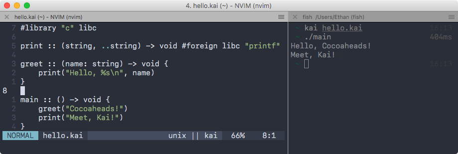
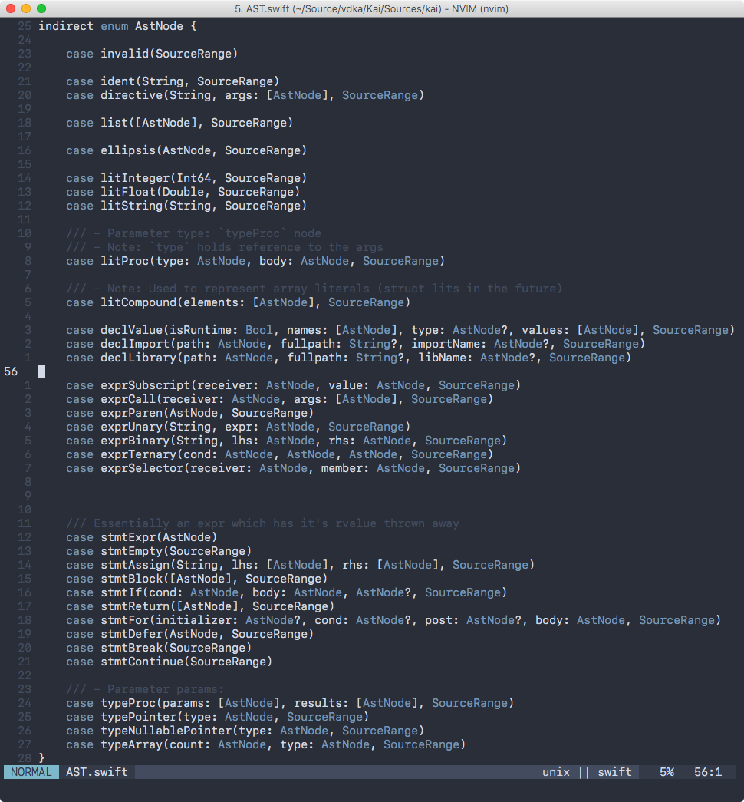
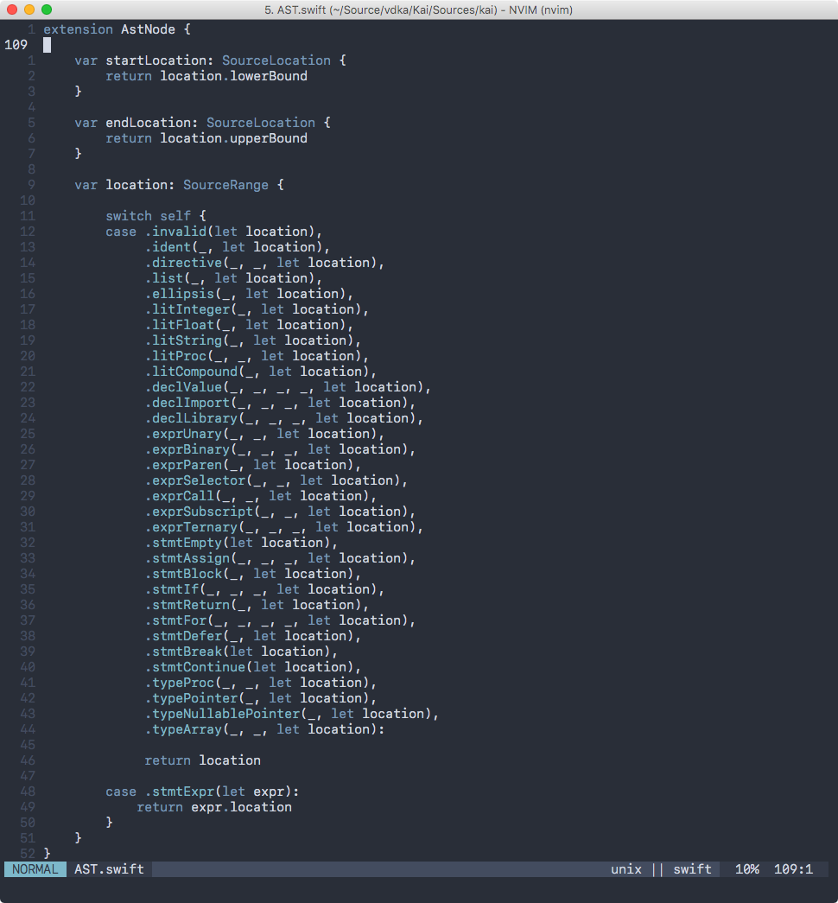
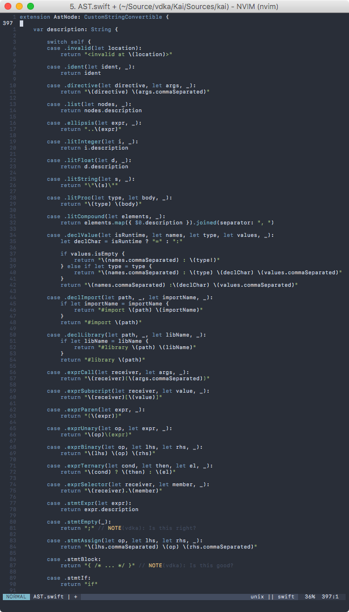
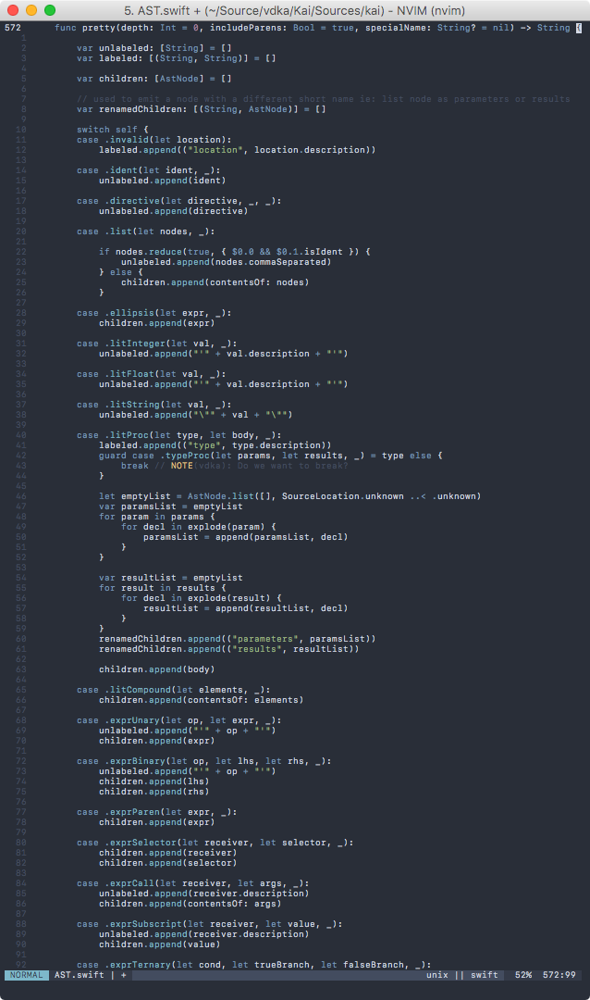

# Kai


---

# Lexing

Turns input text:

^ viewed as UnicodeScalars

`main :: () -> void {}`

Into a stream of `Lexer.Token`:

^ stored as enums sometimes with associated values

`["main", ":", ":", "(", ")", "->", "void", "{", "}"]`

---

# Parsing

Turns a stream of `Lexer.Token`:

`["main", ":", ":", "(", ")", "->", "void", "{", "}"]`

Into an Abstract Syntax Tree:

```lisp
(file '/Users/Ethan/main.kai'
  (declCt names: 'main'
    (litProc type: '() -> void'
      (parameters)
      (results void)
      (stmtBlock))))
```

---

# Checking

Generates a set of annotations for the AST:

```lisp
(file '/Users/Ethan/main.kai'
  (declCt names: 'main' types: '() -> void'
    (litProc type: '() -> void'
      (parameters )
      (results void)
      (stmtBlock))))
```

---

```
extension AstNode: Hashable {
    var hashValue: Int {
        // Because Int is the platform native size, and so are pointers the result is
        //   that the hashValue *should* be the pointer address.
        // Thanks to this we have instance identity as the hashValue.
        return unsafeBitCast(self, to: Int.self)
    }
}
```

```
struct Info {
    var entities:    [Entity:  DeclInfo] = [:]
    var definitions:  [AstNode: Entity]   = [:] // Key: AstNode.ident
    var decls:       [AstNode: DeclInfo] = [:] // Key: AstNode.declValue
    var types:       [AstNode: Type]     = [:] // Key: Any AstNode that can be a type
    var uses:        [AstNode: Entity]   = [:] // Key: AstNode.ident
    var scopes:      [AstNode: Scope]    = [:] // Key: Any AstNode
    var casts:       Set<AstNode>        = [ ] // Key: AstNode.call
}
```

---

# IRGeneration (Using LLVM)

```
; ModuleID = '/Users/Ethan/main.kai'
source_filename = "/Users/Ethan/main.kai"

define void @main() {
entry:
  br label %return

return:                                           ; preds = %entry
  ret void
}
```

---

There are lots of these AST Nodes



---

They all have locations



---

They all have a description



---

... And a Tree print format



---

... And a type annotated version of the same Tree print

In total `AST.swift` is just over **1000 lines** of code on it's own.

---

   | Lexer | Parser  | Checker | IRGen
---|---|---|----|---
LOC|347|616|1616|948
Difficulty|easy|tricky|hard|easy*

^ Helpers ~400 LOC
^ Total is ~5000 LOC

---

# Planned features

---

## Powerful Foreign Function Interface

---

## Language embedded linking support

```
#library "c" libc
#library "/usr/local/lib/libglfw3.dylib" glfw
#library "OpenGL.framework" gl
#library "libraylib.a" raylib
```

---

## Foreign symbol declaration

^ The plan is to support multiple languages

```
initWindow :: (i32, i32, title: string) -> void #foreign raylib "InitWindow"
closeWindow :: () -> void #foreign raylib "CloseWindow"
setTargetFPS :: (i32) -> void #foreign raylib "SetTargetFPS"
windowShouldClose :: () -> bool #foreign raylib "WindowShouldClose"
beginDrawing :: () -> void #foreign raylib "BeginDrawing"
endDrawing :: () -> void #foreign raylib "EndDrawing"
clearBackground :: (color: u32) -> void #foreign raylib "ClearBackground"
drawText :: (string, x: i32, y: i32, size: i32, color: u32) -> void #foreign raylib "DrawText"
```

---

## C header imports

This is a planned feature that `libClang` already provides functionality for.

Using `#import "dlopen.h"` you will have an interface file generates similar to the one above automatically for you.

---

# Demo

---

# Questions?
